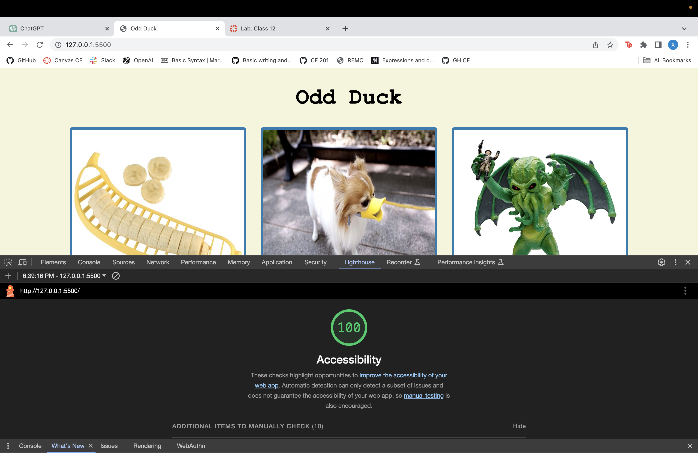
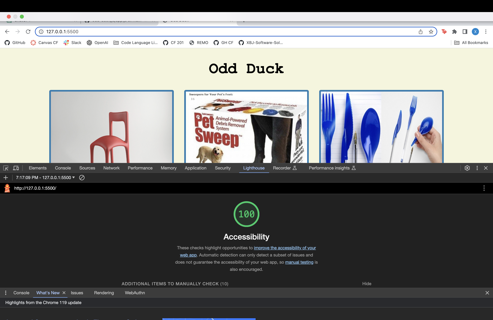
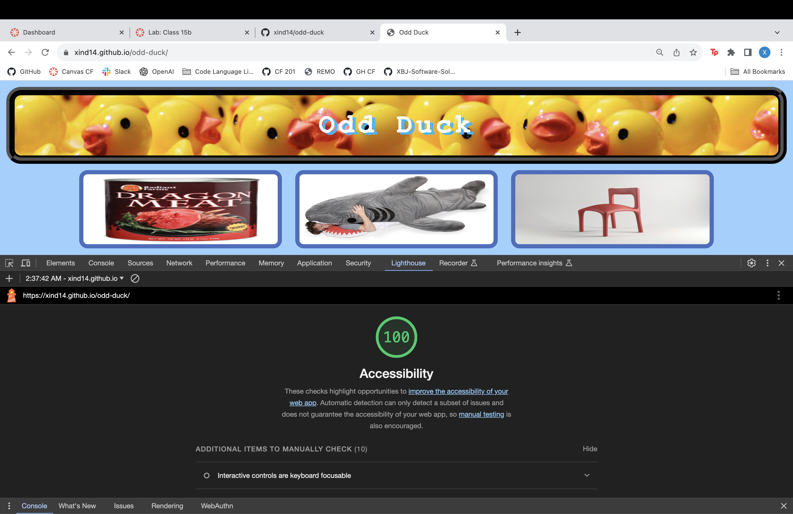

# Lab 11, 12, 13, 15

## Odd Duck Overview

I developed a site for Odd Duck Product Co that wanted to streamline the selection of their next products through employee voting. The site features a dynamic interface displaying three potential products side-by-side, with an algorithm ensuring random and unbiased image generation. Users can click on their preferred product and their selections are tracked while controlling the number of voting rounds to 25. After a week of data collection, the site provides a chart with the results to visually represent votes data. To enhance user experience, local storage is implemented for persistent data tracking between page refreshes.

## Odd Duck Pt. 1

### Author: Xin Deng

### Links and Resources

1. [Setting Up a New Code 201 Project](https://codefellows.github.io/code-201-guide/curriculum/class-02/project-setup)

2. [Loren Ipsum for replacement text](https://www.lipsum.com/)

### Lighthouse Accessibility Report Score

### Reflections and Comments

1. How did this go, overall?

  - I thought I could make something complex in HTML, but I just didn't have enough time so I used the in demo for today as the guideline and had to remake my HTML from scratch with two hours before the due date.

2. What observations or questions do you have about what you’ve learned so far?

- I cannot figure out if grid is helpful or not. I can't figure out CSS and how to move certain things around with grid laid out from the grid website.

3. How long did it take you to complete this assignment? And, before you started, how long did you think it would take you to complete this assignment?
 
- It took me 11 hours because I had to restart to hit at least some of the instructions for lab 11. I thought it would take me long but didn't think it would take this long. 

## Odd Duck Pt. 2

### Author: Xin Deng

### Links and Resources

1. [Setting Up a New Code 201 Project](https://codefellows.github.io/code-201-guide/curriculum/class-02/project-setup)

### Lighthouse Accessibility Report Score

### Reflections and Comments

1. How did this go, overall?

  - This went a lot better in terms of JS, I was able to figure out how to render results after voting and make sure no two images appeared in two rounds. CSS was a pain when I was trying to work with grid. I gave up on that and went back to flexbox.

2. What observations or questions do you have about what you’ve learned so far?

- It is extremely helpful to use a third party JS source. If only there was something like that for CSS to make it easier.

3. How long did it take you to complete this assignment? And, before you started, how long did you think it would take you to complete this assignment?
 
- This took me 5 hours which was 6 less then yesterday so that is a huge win for me. I thought it was going to take longer to be honest but I'm glad it didn't.

## Odd Duck Pt. 3

### Author: Xin Deng

### Links and Resources

1. [Setting Up a New Code 201 Project](https://codefellows.github.io/code-201-guide/curriculum/class-02/project-setup)

### Lighthouse Accessibility Report Score

### Reflections and Comments

1. How did this go, overall?

 - I added so little lines of code and it still took me so long. I just couldn't find where to put the local storage get and set lines and it took me awhile to figure out and then I got ambitious and wanted to add in two charts one for votes and one for views and it messed everything up and I had to fix all the ideas I wanted to try.

2. What observations or questions do you have about what you’ve learned so far?

- It seems easy enough because the code is short, but sometimes the easier looking things are actually not so I have to prepare myself for that.

3. How long did it take you to complete this assignment? And, before you started, how long did you think it would take you to complete this assignment?
 
- It took me 6 hours to do this one. I thought it was going to be shorter but I was playing around too much or wanting to add too much and fixing my mistakes took more time.

## Odd Duck Pt. 4

### Author: Xin Deng

### Links and Resources

1. [Setting Up a New Code 201 Project](https://codefellows.github.io/code-201-guide/curriculum/class-02/project-setup)

2. [W3Schools CSS Site](https://www.w3schools.com/css/)

### Lighthouse Accessibility Report Score

### Reflections and Comments

1. How did this go, overall?

- Since this lab gave me an extra day I felt like I had time to explore CSS a lot without stressing about time. I just had fun with it and really enjoyed this last part of lab.

2. What observations or questions do you have about what you’ve learned so far?

- I'm not quite sure where to look for the correct chart.js config nested objects are. I had an issue with adjusting font sizes with the views and votes labels and the legend labels. I got the legend to change sizes but the votes and views didn't and when I got the votes and views labels to change sizes the legend didn't change. It took me comparing those two errors that they were nested in wrong places.

3. How long did it take you to complete this assignment? And, before you started, how long did you think it would take you to complete this assignment?
 
- It took me 7 hours which I was fine with this time because I took time to really explore the different CSS properties and how they work. I thought it was going to take me long because I still don't know if we were suppose to apply lab 14 format to lab 15. 