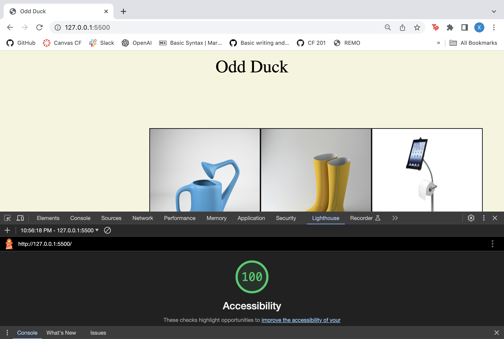

# Lab 11, 12, 13, 14, 15

## Odd Duck Pt. 1

### Author: Xin Deng

### Links and Resources

1. [Setting Up a New Code 201 Project](https://codefellows.github.io/code-201-guide/curriculum/class-02/project-setup)

2. [Loren Ipsum for replacement text](https://www.lipsum.com/)

3. [Grid Generator](https://grid.layoutit.com/)

### Lighthouse Accessibility Report Score

### Reflections and Comments

1. How did this go, overall?

  - I thought I could make something complex in HTML, but I just didn't have enough time so I used the in demo for today as the guideline and had to remake my HTML from scratch with two hours before the due date.

2. What observations or questions do you have about what you’ve learned so far?

- I cannot figure out if grid is helpful or not. I can't figure out CSS and how to move certain things around with grid laid out from the grid website.

3. How long did it take you to complete this assignment? And, before you started, how long did you think it would take you to complete this assignment?
 
- It took me 11 hours because I had to restart to hit at least some of the instructions for lab 11. I thought it would take me long but didn't think it would take this long. 